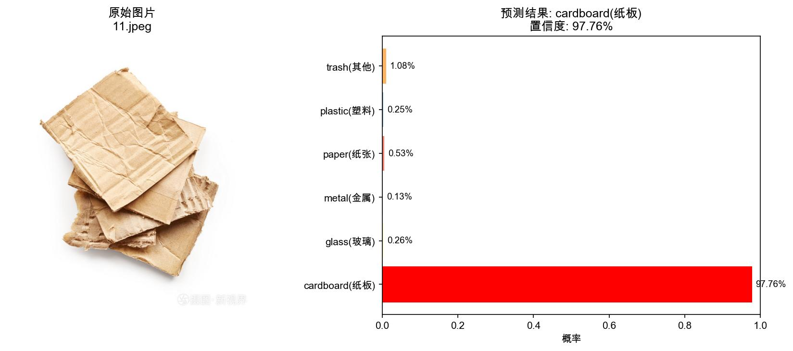
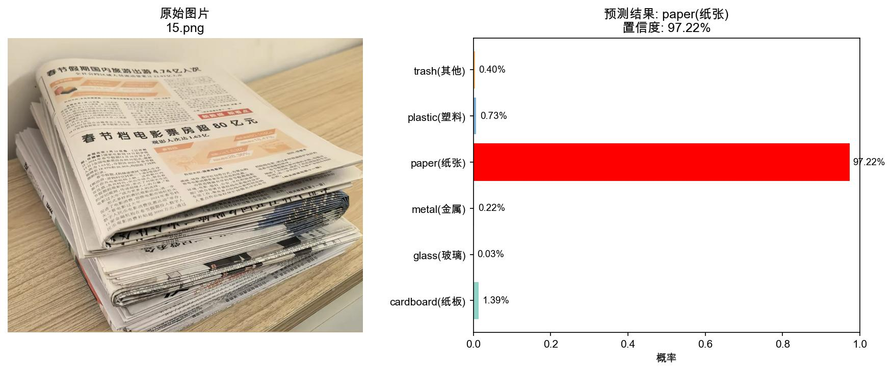
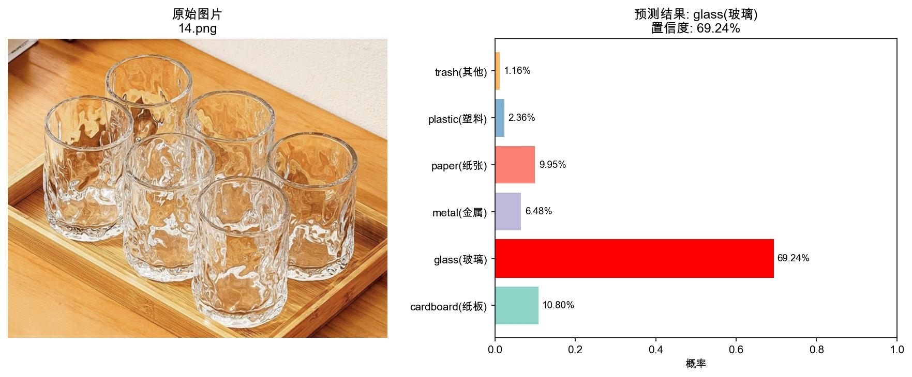
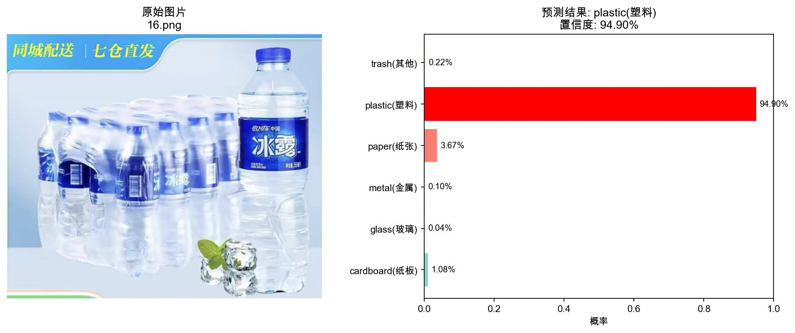
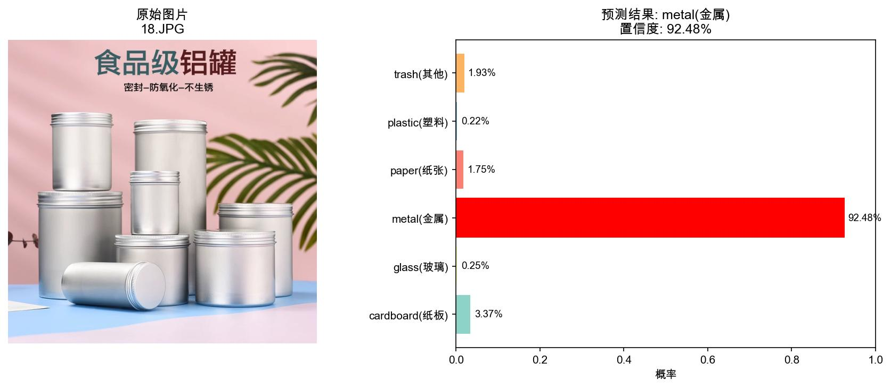

# Garbage_classification_mobilenetv2
基于 MobileNetV2 的轻量垃圾分类图像识别（M1 本地训练可用）

## 项目说明
本项目基于 PyTorch + MobileNetV2 迁移学习，实现 **6 类生活垃圾图像自动分类**。
- 全程在 **Mac M1/M2（MPS）** 训练，**无需独立 GPU**
- 训练约 20 分钟，**验证集准确率 ≈ 92%**
- 支持：单张/批量预测、置信度输出、可视化结果、自动生成报告

## 训练硬件与环境
- 设备：MacBook Air（M1 芯片）
- 加速：PyTorch MPS 加速
- 依赖：torch、torchvision、matplotlib

## 模型效果示例
输入图片 → 输出类别 + 置信度 + 概率分布可视化：







## 目录结构
Garbage_classification_mobilenetv2/
├── train.py # 训练脚本
├── predict.py # 预测脚本（单张 / 批量）
├── best_model_v2.pth # 最优模型权重
├── garbage_classification/ # 数据集（6 类子文件夹）
└── predict_results/ # 预测结果（自动生成）

## 模型效果
- 数据集：6 类（纸板/玻璃/金属/纸张/塑料/其他垃圾）
- 训练时长：约 20 分钟（M1）
- 最优准确率：**Val Acc ≈ 92.1%**
- 易混淆：玻璃（glass）↔ 金属（metal），其余类别效果较好

### 训练曲线
- Loss：快速下降并收敛
- Val Acc：稳定上升至 92%+

## 快速使用
1. 克隆项目并进入目录
```bash
git clone https://github.com/Alan20050320/Garbage_classification_mobilenetv2.git
cd Garbage_classification_mobilenetv2
```

2. 安装依赖
```bash
pip install torch torchvision matplotlib
```

3. 训练模型
```bash
python train.py
```
脚本会自动启用 MPS 加速，按 8:2 划分训练/验证集，训练完成后保存最优模型 `best_model_v2.pth`。

4. 图片预测
```bash
# 默认路径批量预测
python predict.py

# 自定义图片文件夹批量预测
python predict.py 你的图片文件夹路径
```
预测结果自动保存到 `predict_results` 目录，包含可视化图片与分类报告。

## 支持分类类别
1. 纸板（cardboard）
2. 玻璃（glass）
3. 金属（metal）
4. 纸张（paper）
5. 塑料（plastic）
6. 其他垃圾（trash）

## 适用场景
- 课程作业 / 入门深度学习项目
- 移动端/嵌入式垃圾分类原型
- 无 GPU 设备快速训练、演示

## 备注
项目适配 Mac M1 设备，无需独立 GPU 即可完成训练与推理，代码可直接复现运行。
